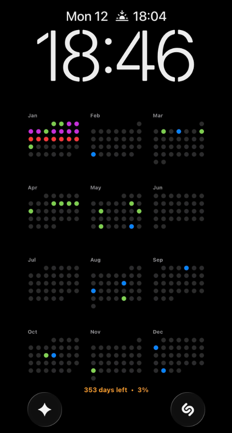
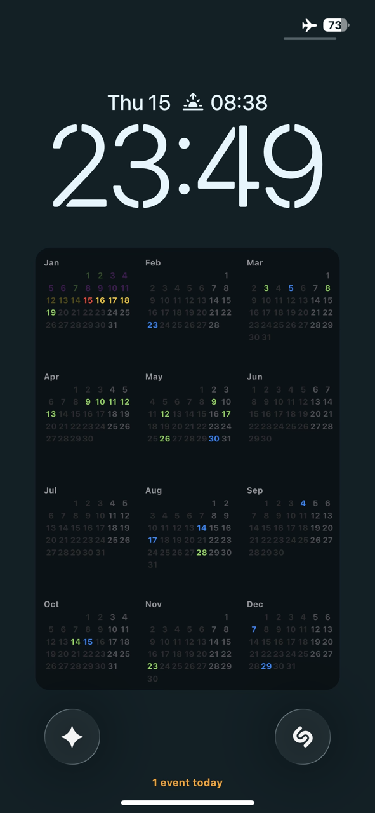
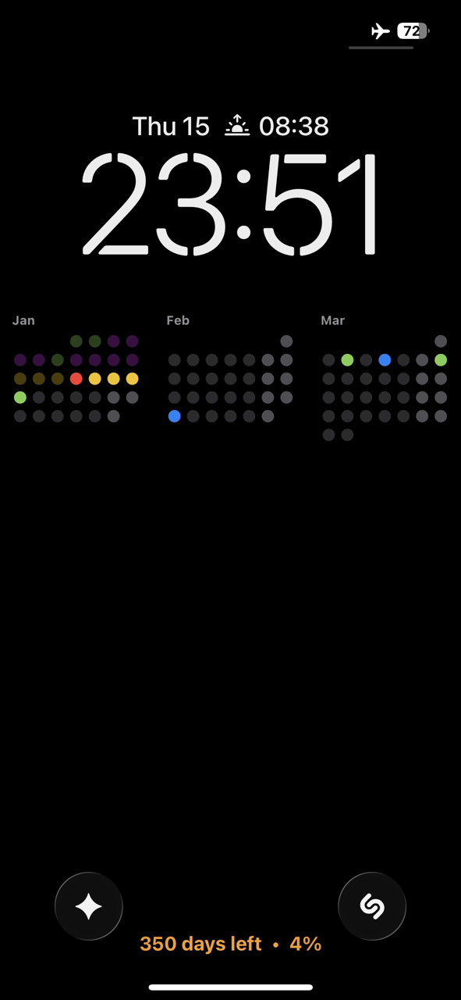
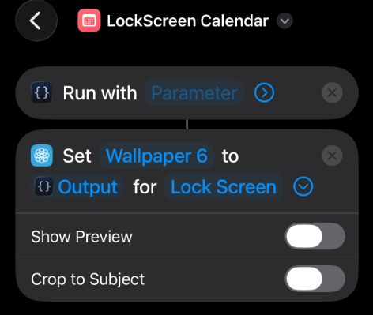
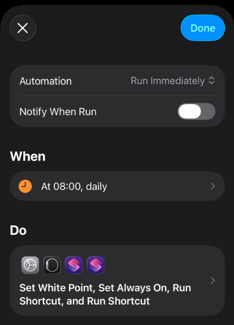

# LockScreen Calendar Shortcut

This script for the Scriptable app generates minimalistic wallpapers for iPhone featuring a yearly calendar, event display, and current year progress.

## Description

The script automatically scans your iOS calendars, filters them by a special prefix (or you can add them manually in script itself), and displays events on a yearly grid on your lock screen. Event colors are taken directly from iOS Calendar settings. It supports custom wallpapers from your Photos album, beautiful gradients, or clean solid colors.






## Features

- **Auto-Adaptation**: Adapts to your iPhone's screen size.
- **Native Colors**: Uses colors set in the Calendar app.
- **Filtering**: Displays only calendars with a specific prefix (default `*`), or you can add them manually in script itself to keep the screen uncluttered.
- **Event Priority**: When events overlap, priority is determined alphabetically by calendar name or randomly (in case of manually added calendars priority is determined by order in script).
- **Backgrounds**:
  - **Custom Photos**: Use any photo from your library as a background.
  - **Gradients**: Use stylish CSS-like linear gradients (3 colors).
  - **Solid Colors**: Minimalist solid background.
- **Legibility**: "Container" card option to ensure calendar is readable on any background.
- **Statistics**: Shows events count or year progress.

## Installation and Setup

### Option A: Using Scriptable App (Recommended)
1. Install [Scriptable](https://apps.apple.com/us/app/scriptable/id1405459188) from the App Store.
2. Create a new script, name it `LockScreenCalendar`, and copy the code from `script.js` into Run Script action.
3. In iOS settings (Calendar), rename existing calendars that you want to display by adding `*` to the beginning (e.g., `*Work`) or add them manually in script.

### Option B: Paste Directly in Shortcuts
1. You can skip creating a file in Scriptable and paste the entire code directly into the **Run Script** action in Shortcuts.

---

### Shortcuts Workflow Setup

#### 1. Basic Setup (Solid Color / Gradient)
1. Create a new Shortcut.
2. Add **Run Script** action (Scriptable). Select your script (or paste code).
3. Add **Set Wallpaper** action.
   - Image: Select "Output" from previous step.
   - Screen: "Lock Screen".
   - **Disable "Show Preview" and "Crop to Subject"**.
- For gradient background, ensure `showWallpaper` is set to `false` in the script. and `useGradient` is set to `true`.

#### 2. Using Custom Wallpaper (Photos)
To use a random photo from an album as a background:

1. Create an album in Photos (e.g., "Wallpapers").
2. In Shortcuts, add **Find Photos** action at the very top.
   - Filter: **Album is "Wallpapers"**.
   - Sort by: **Random**.
   - Limit: **Get 1 Item**.
3. In the **Run Script** action:
   - Tap and hold the **Parameter** field (it might say "Input" or be empty).
   - Select **Photos** (the output from the first step).
4. In the script `CONFIG`, ensure:
   ```javascript
   showWallpaper: true
   ```



### Automation
To update daily:
1. Go to "Automation" tab -> "Personal Automation".
2. Select **Time of Day** (e.g., 08:00).
3. Add **Run Shortcut** action -> Select your shortcut.
4. Disable "Ask Before Running" and "Notify When Run" so it happens in the background.




## Configuration

Customize `CONFIG` at the top of the script:

```javascript
const CONFIG = {
  // --- 1. GENERAL & APPEARANCE ---
  monthsToShow: 12,        // 12 = Year, 3 = Quarter, 1 = Month
  monthsPerRow: 3,         // Standard is 3
  monthOffset: 0,          // Start from 0 = Current, -1 = Previous, 1 = Next
  contentScale: 1.0,       // Global Scale Multiplier

  // Day & Dot Settings
  showDayNumbers: false,   // true = numbers, false = dots
  firstDayOfWeek: 1,       // 0 = Sunday, 1 = Monday
  highlightWeekends: true,
  dimPastDays: true,       // If true, past days are 30% opacity

  // --- 2. BACKGROUND SETTINGS ---
  // Custom Wallpaper (Photo from Shortcuts)
  showWallpaper: true,     // Priority 1: Use photo if provided via Input
  overlayOpacity: 0.3,     // Darken photo (0.0 - 1.0)
  
  // Gradient (Priority 2: Used if no photo or showWallpaper=false)
  useGradient: true,
  gradientColors: ["#0F2027", "#203A43", "#2C5364"], // Example: "Moonlit Asteroid"
  
  // Container (Card behind calendar for better visibility)
  showContainer: true,
  containerOpacity: 0.80,
  containerRadius: 15,

  // ... (Other standard settings)
};
```
